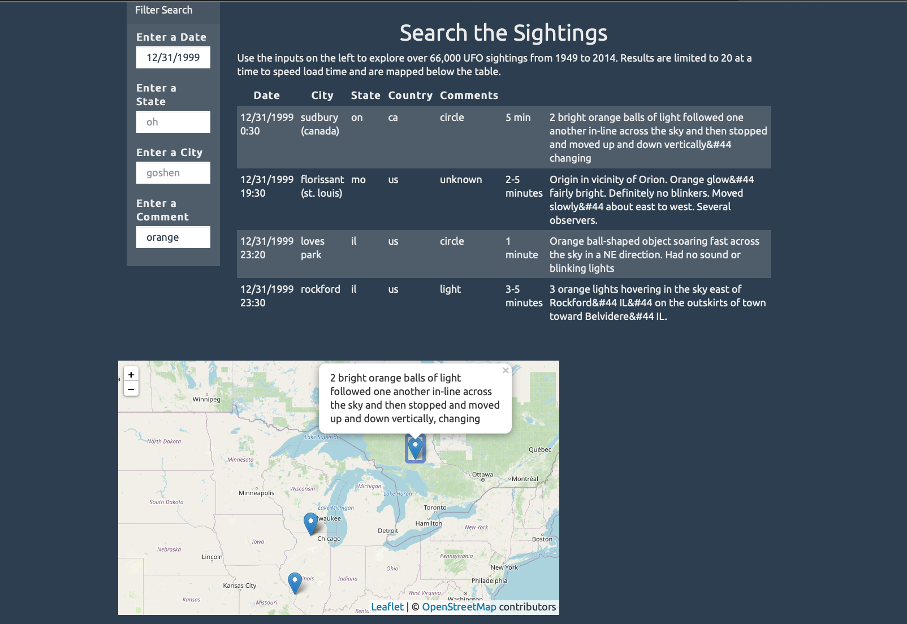

## UFO Sightings 

### About
This project allows the user to sort through a database of over 66,000 UFO reported sightings
between 1969 and 2014. Inputs are filtered to produce a table of findings that simultaneously display in a map.

### <a href="https://sherirosalia.github.io/ufo_sightings/">Link</a>
### Frameworks
D3.js and Leaflet.js transform the data and Bootstrap 4 the website template. 

### File Structure
In the "static" file folder find all supporting scripts.
Python file to convert the csv data to json is inside of the "csv_modify" directory.
To run the project, download and open the index.html in a browser.

### Screenshot of search result

